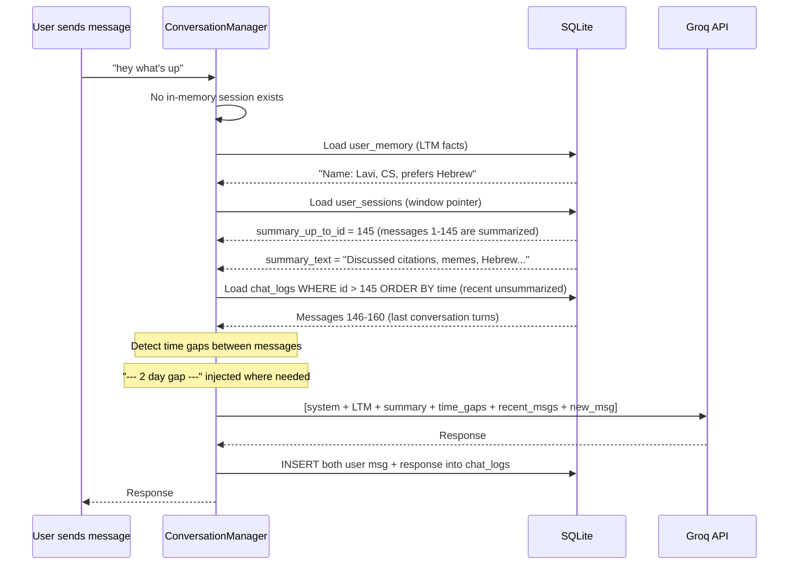
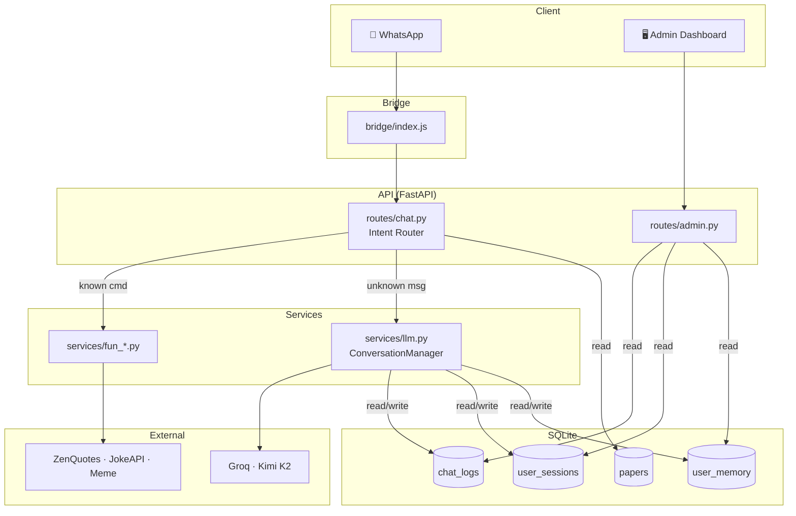

# Scholar Tracker — LLM System Architecture (Final)

## Key Design Decision

> **SQLite is the source of truth.** Every message is stored permanently.
> In-memory state is just a **cache** — rebuilt from DB at any time.
> No data is ever lost on session expire, server restart, or crash.

---

## Memory Architecture

### 3 Tiers — All Backed by SQLite

```
┌─────────────────────────────────────────────────────────────┐
│  SOURCE OF TRUTH: SQLite                                    │
│                                                             │
│  chat_logs table     — every message ever sent/received     │
│  user_memory table   — extracted key facts per user         │
│  user_sessions table — sliding window pointer per user      │
└─────────────────────────────────────────────────────────────┘
         ↑ persist                    ↓ load on demand
┌─────────────────────────────────────────────────────────────┐
│  IN-MEMORY CACHE (performance only, rebuilt from DB)        │
│                                                             │
│  sessions["972..."] = {                                     │
│      messages: [...],          # recent turns (from DB)     │
│      summary: "...",           # from DB pointer            │
│      ltm_facts: "...",         # from user_memory table     │
│  }                                                          │
└─────────────────────────────────────────────────────────────┘
```

### What Happens in Each Scenario

| Scenario | What happens |
|----------|-------------|
| **Normal message** | Append to `chat_logs`, update in-memory cache |
| **Session idle 1hr** | Drop in-memory cache (DB untouched) |
| **Server restart** | In-memory cache cleared. Next message rebuilds from DB |
| **Message after 2 days** | Load recent history from `chat_logs`, inject time gap, load LTM facts |
| **10K tokens reached** | Extract facts → `user_memory`, mark summarized messages |

---

## Session Reconstruction Flow

When a user sends a message and there's **no in-memory cache**:



### Time Gap Detection

When loading messages from DB, check timestamps between consecutive messages:

```python
messages_from_db = load_recent_messages(user_id)

context = []
for i, msg in enumerate(messages_from_db):
    if i > 0:
        gap = msg.created_at - messages_from_db[i-1].created_at
        if gap > timedelta(hours=2):
            context.append({
                "role": "system",
                "content": f"[{format_gap(gap)} gap in conversation]"
            })
    context.append({"role": msg.role, "content": msg.content})

# Result: the LLM sees natural time breaks
# ["Hey!", "Sure!", "[2 day gap]", "I'm back!", ...]
```

---

## Database Schema

```sql
-- All messages (source of truth)
CREATE TABLE chat_logs (
    id INTEGER PRIMARY KEY AUTOINCREMENT,
    user_id TEXT NOT NULL,
    role TEXT NOT NULL,               -- 'user' | 'assistant'
    content TEXT NOT NULL,
    tokens_used INTEGER DEFAULT 0,
    model TEXT DEFAULT '',
    intent TEXT DEFAULT '',           -- 'llm' | 'stats' | 'meme' | etc.
    created_at DATETIME DEFAULT CURRENT_TIMESTAMP
);

-- Sliding window pointer (tracks what's been summarized)
CREATE TABLE user_sessions (
    user_id TEXT PRIMARY KEY,
    summary_text TEXT DEFAULT '',      -- compressed summary of old messages
    summary_up_to_id INTEGER DEFAULT 0,-- chat_logs.id up to which we've summarized
    updated_at DATETIME DEFAULT CURRENT_TIMESTAMP
);

-- Long-term memory (key facts, survives everything)
CREATE TABLE user_memory (
    user_id TEXT PRIMARY KEY,
    facts TEXT NOT NULL,              -- LLM-extracted: "Name: Lavi, field: CS..."
    updated_at DATETIME DEFAULT CURRENT_TIMESTAMP
);

CREATE INDEX idx_chat_logs_user ON chat_logs(user_id);
CREATE INDEX idx_chat_logs_time ON chat_logs(created_at);
CREATE INDEX idx_chat_logs_user_id ON chat_logs(user_id, id);
```

### How the Sliding Window Pointer Works

```
chat_logs:
  id=140  user: "hi"
  id=141  bot:  "hello!"
  id=142  user: "show stats"          ┐
  id=143  bot:  "you have 12 papers"  │ summarized
  id=144  user: "what about memes"    │ into summary_text
  id=145  bot:  "here's a meme!"     ┘
  ─── summary_up_to_id = 145 ────────
  id=146  user: "tell me a joke"      ┐
  id=147  bot:  "why did the..."      │ loaded verbatim
  id=148  user: "haha good one"       │ (working memory)
  id=149  bot:  "glad you liked it!"  ┘
  id=150  user: "what's new?"         ← NEW message
```

On next summarization: LLM compresses 146-149 into summary, updates pointer to 149.

---

## Context Stack (what the LLM sees per call)

```python
messages = [
    # 1. Personality
    {"role": "system", "content": SYSTEM_PROMPT},

    # 2. Time awareness
    {"role": "system", "content": f"Current time: {now}. "
     f"User last active: {last_active} ({gap} ago)."},

    # 3. App state (live from DB)
    {"role": "system", "content": f"User tracks {n} papers, "
     f"{total} citations (+{delta} new)."},

    # 4. Long-term memory (from user_memory)
    {"role": "system", "content": f"Known facts: {ltm_facts}"},

    # 5. Session summary (from user_sessions)
    {"role": "system", "content": f"Conversation history: {summary}"},

    # 6. Recent messages (from chat_logs, with time gaps)
    {"role": "user", "content": "tell me a joke"},
    {"role": "assistant", "content": "why did the..."},
    {"role": "system", "content": "[2 day gap]"},
    {"role": "user", "content": "I'm back!"},

    # 7. New message
    {"role": "user", "content": "what's new?"},
]
```

---

## System Diagram



---

## Phased Implementation

### Phase 1 — LLM Core + DB-Backed Memory
| Step | File | What |
|------|------|------|
| 1.1 | [config.py](file:///c:/antigravity/scholar-tracker/src/scholar_tracker/config.py) | Add `groq_api_key`, `llm_model` |
| 1.2 | [pyproject.toml](file:///c:/antigravity/scholar-tracker/pyproject.toml) | Add `groq` dependency |
| 1.3 | `prompts/system.txt` | Bot personality + Hebrew rule |
| 1.4 | [models/database.py](file:///c:/antigravity/scholar-tracker/src/scholar_tracker/models/database.py) | 3 new tables + CRUD functions |
| 1.5 | `services/llm.py` | ConversationManager (3-tier, DB-backed) |
| 1.6 | [routes/chat.py](file:///c:/antigravity/scholar-tracker/src/scholar_tracker/routes/chat.py) | LLM in else branch, pass sender phone |
| 1.7 | `tests/test_llm.py` | 8 tests (see below) |

**Tests:**
```
test_returns_response            — basic LLM reply
test_messages_persisted          — chat_logs has entries after call
test_session_context_in_memory   — remembers name within session
test_session_rebuild_from_db     — drop cache, next msg loads from DB
test_time_gap_injected           — 2hr+ gap shows "[gap]" in context
test_ltm_extraction_at_10k      — facts stored in user_memory
test_ltm_loaded_on_new_session  — new session includes old facts
test_groq_error_fallback        — graceful msg on API failure
```

### Phase 2 — Admin Dashboard
| Step | File | What |
|------|------|------|
| 2.1 | `routes/admin.py` | Stats, logs, sessions APIs |
| 2.2 | `ui/admin.html` | Dashboard page |
| 2.3 | [main.py](file:///c:/antigravity/scholar-tracker/main.py) | Mount admin router |

### Phase 3 — Polish
| Step | File | What |
|------|------|------|
| 3.1 | `services/llm.py` | `reset` command, session cleanup |
| 3.2 | Tests | Hebrew response, reset |
